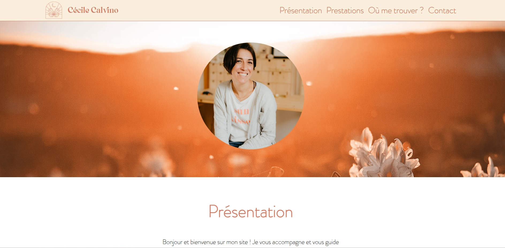

# Projet Kinesio - Site Vitrine pour une Kinésiologue

Ce projet représente mon premier effort en conditions professionnelles et consiste en la création d’un site vitrine pour une kinésiologue. Ce fut l’occasion d’appliquer mes compétences dans le développement de sites web tout en découvrant de nouvelles technologies et en suivant un cahier des charges strict.

## Table des Matières

- [Contexte du Projet](#contexte-du-projet)
- [Technologies Utilisées](#technologies-utilisées)
- [Fonctionnalités Principales](#fonctionnalités-principales)
- [Challenges et Solutions](#challenges-et-solutions)
- [Installation en Local](#installation-en-local)
- [Voir le Site en Ligne](#voir-le-site-en-ligne)
- [Conclusion et Perspectives](#conclusion-et-perspectives)
- [Contact](#contact)

## Contexte du Projet

La kinésiologue souhaitait avoir une présence en ligne pour promouvoir ses services. J'ai été chargé de développer un site qui met en valeur son expertise, informe les clients potentiels des services proposés et fournit des informations de contact et de localisation. Le projet avait des contraintes de couleurs et de polices prédéfinies.

## Technologies Utilisées

- **HTML5**: Utilisé pour structurer le contenu de la page.
- **CSS3**: Pour styliser la page selon les directives du cahier des charges.
- **JavaScript**: Utilisé pour ajouter de l'interactivité et de la logique côté client.
- **Tailwind CSS**: Un framework CSS utilisé pour accélérer le développement et assurer un design réactif.
- **API OpenStreetMap**: Intégrée pour afficher la localisation du cabinet sur une carte interactive.
- **AOS (Animate on Scroll)**: Bibliothèque utilisée pour ajouter des animations au défilement et améliorer l'expérience utilisateur.

## Fonctionnalités Principales

- **Page d'accueil**: Présentation de la kinésiologue et introduction aux services offerts.
- **Section Services**: Détails des services proposés avec une description de chaque.
- **Carte interactive**: Localisation précise du cabinet avec l'API OpenStreetMap.
- **Animations**: Mise en œuvre d'animations au défilement grâce à AOS pour améliorer l'attrait visuel.

## Challenges et Solutions

- **Respect du cahier des charges**: Suivre les directives précises tout en créant un design attrayant a été un défi. J'ai dû faire des choix judicieux en matière de mise en page tout en respectant les contraintes.
- **Intégration d’API**: L'apprentissage de l'intégration de l'API OpenStreetMap a nécessité des recherches et des tests.
- **Réactivité et optimisation mobile**: J’ai utilisé Tailwind CSS pour m'assurer que le site est réactif et optimisé pour différents appareils.

## Installation en Local

Pour installer et exécuter ce projet localement, suivez les étapes ci-dessous:

1. Clonez le dépôt

git clone git@github.com:Krizold/Projet-Kinesio.git

2. Naviguez dans le répertoire du projet

cd Projet-Kinesio

3. Ouvrez `index.html` dans votre navigateur

## Voir le Site en Ligne

Le site est disponible en ligne à l'adresse [https://cecilecalvino.com/](https://cecilecalvino.com/).

## Conclusion et Perspectives

Ce projet a été une opportunité incroyable d’apprendre et de mettre en pratique mes compétences en développement web. Dans le futur, je souhaite continuer à améliorer mes compétences et peut-être ajouter de nouvelles fonctionnalités ou optimiser davantage le site pour les moteurs de recherche, améliorer ses animations, et mettre en place un module de réservation en ligne.

## Contact

Si vous avez des questions ou souhaitez en savoir plus sur ce projet, n'hésitez pas à me contacter:

- GitHub: [Krizold](https://github.com/Krizold)
- Lien du projet sur GitHub: [Projet Kinesio](https://github.com/Krizold/Projet-Kinesio)

